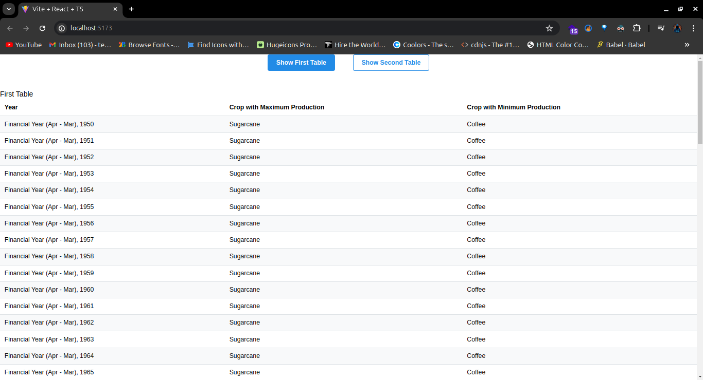
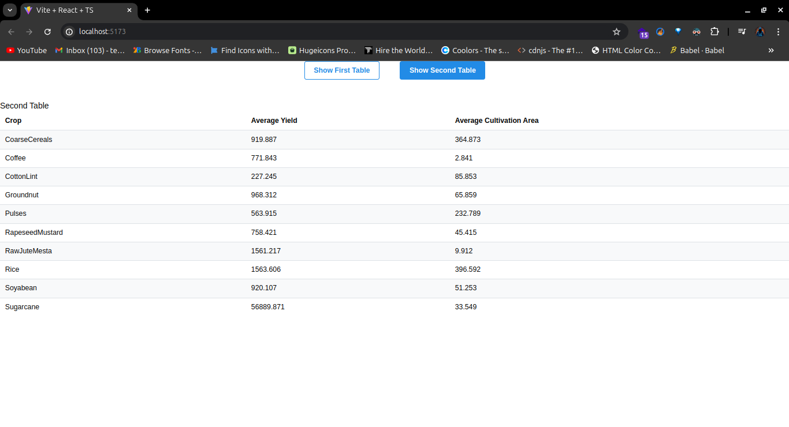

````markdown
# analytic_crop

This project utilizes React with TypeScript in Vite to perform analytics on Indian Agriculture crop data, as per the requirements provided by Manufac Analytics Pvt. Ltd.

## Table of Contents

-   [Introduction](#introduction)
-   [Installation](#installation)
-   [Usage](#usage)
-   [Scripts](#scripts)
-   [Project Details](#project-details)
-   [Evaluation Criteria](#evaluation-criteria)
-   [Screenshots](#screenshots)
-   [Submission](#submission)

## Introduction

This repository contains a React application set up with TypeScript and Vite to analyze and display agricultural data. It leverages Vite for fast development and HMR (Hot Module Replacement) and includes ESLint for code quality.

## Installation

Ensure you have Node.js installed on your machine.

```bash
# Clone the repository
git clone https://github.com/Gourav224/analytic_crop.git

# Navigate into the project directory
cd analytic_crop

# Install dependencies using npm
npm install
```
````

## Usage

To start the development server and view the application in your browser:

```bash
npm run dev
```

This command will launch the application at `http://localhost:3000`.

## Scripts

-   `npm run dev`: Starts the development server with Vite.
-   `npm run build`: Builds the production-ready bundle.
-   `npm run lint`: Lints TypeScript files using ESLint.
-   `npm run format`: Formats code using Prettier.
-   `npm run test`: Runs tests, if any.

## Project Details

-   **Tools Used**: React, TypeScript, Vite, ESLint
-   **Functionality**: Analyzes and displays Indian Agriculture crop data.
-   **Enhancements**: You can expand ESLint configuration for production applications by updating `parserOptions` and installing additional ESLint plugins.

## Evaluation Criteria

1. **Functionality**: Ensure calculated values are accurate and functions are efficient.
2. **Code Quality**: Maintain clean code, modularity, and adhere to ESLint rules.
3. **README**: Include screenshots of tables and clear instructions for setup and usage.
4. **Bonus**: Utilize TypeScript for type safety.

## Screenshots

Include screenshots of your application's tables here.

-   Table 1: Crop Production Analysis



-   Table 2: Crop Yield and Cultivation Area Analysis


